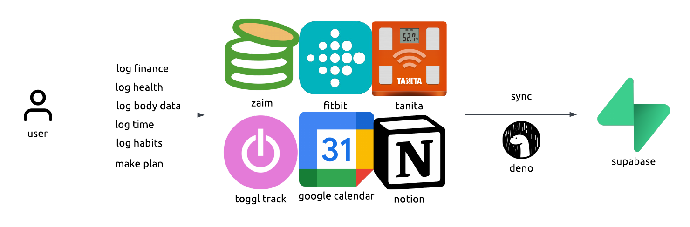

# supabase-sync-jobs

LIFETRACER の中核となるデータ同期基盤。複数の外部サービスから個人データを取得し、Supabase（PostgreSQL）に統合保存する。



## 概要

60年以上の長期データ保持と自己理解を目的とした個人データエコシステム。各サービスの専用ツールを活用しつつ、データは Supabase に集約し、ベンダー非依存の分析基盤を構築する。

### データソース

| サービス | 用途 | スキーマ |
|----------|------|---------|
| [Toggl](src/services/toggl/) | 時間記録（実績） | `toggl` |
| [Google Calendar](src/services/gcalendar/) | 予定（計画） | `gcalendar` |
| [Fitbit](src/services/fitbit/) | 睡眠・心拍・活動 | `fitbit` |
| [Tanita](src/services/tanita/) | 体組成・血圧 | `tanita` |
| [Zaim](src/services/zaim/) | 家計簿 | `zaim` |

## クイックスタート

### 環境変数

```bash
# 共通（必須）
SUPABASE_URL=https://xxxxx.supabase.co
SUPABASE_SERVICE_ROLE_KEY=xxxxx

# 各サービス固有（詳細は各READMEを参照）
```

### 実行

```bash
# 全サービス日次同期
deno run --allow-env --allow-net --allow-read src/sync_all.ts

# 個別サービス同期
deno run --allow-env --allow-net --allow-read src/services/toggl/sync_daily.ts
deno run --allow-env --allow-net --allow-read src/services/fitbit/sync_daily.ts
```

### テスト

```bash
# 全単体テスト（154件）
deno task test

# 環境確認（API疎通、DB書き込みなし）
deno task check

# 同期確認（⚠️ DB書き込みあり）
deno task check:sync
```

## ディレクトリ構成

```
supabase-sync-jobs/
├── src/
│   ├── services/           # サービス別モジュール
│   │   ├── fitbit/         # Fitbit 同期
│   │   ├── gcalendar/      # Google Calendar 同期
│   │   ├── tanita/         # Tanita 同期
│   │   ├── toggl/          # Toggl 同期
│   │   └── zaim/           # Zaim 同期
│   ├── utils/              # 共通ユーティリティ
│   └── sync_all.ts         # 全サービス並列同期
├── test/                   # テストスイート
├── supabase/               # マイグレーション
├── .github/workflows/      # GitHub Actions
└── deno.json               # タスク定義
```

## アーキテクチャ

### サービス共通構成

各サービスは統一されたファイル構成に従う:

| ファイル | 責務 |
|----------|------|
| `types.ts` | API型・DB型定義 |
| `auth.ts` | 認証（OAuth/Basic） |
| `api.ts` | APIクライアント |
| `fetch_data.ts` | データ取得オーケストレーション |
| `write_db.ts` | DB書き込み（変換・upsert） |
| `sync_daily.ts` | 日次同期（実行可能） |
| `sync_all.ts` | 全件同期（実行可能、一部サービス） |

### データフロー

```
sync_daily.ts / sync_all.ts（オーケストレーター）
    │  同期日数決定、OAuth トークン確認、エラーハンドリング
    ▼
fetch_data.ts（データ取得層）
    │  日付範囲計算、チャンク分割、レート制限対応
    ▼
api.ts（APIクライアント層）
    │  外部APIリクエスト、auth.tsから認証情報取得
    ▼
write_db.ts（DB書き込み層）
       API型→DB型変換、バッチupsert
```

### 認証パターン

| パターン | サービス | 認証方式 | トークン管理 |
|----------|----------|----------|-------------|
| A | fitbit, tanita | OAuth 2.0 | Supabase DB |
| B | gcalendar | Service Account (JWT) | メモリキャッシュ |
| C | toggl, zaim | Basic / OAuth 1.0a | 環境変数 |

### 主要な設計パターン

**型命名規則:**
- APIレスポンス型: `{Service}Api{Entity}` (例: `FitbitApiSleepResponse`)
- DBテーブル型: `Db{Entity}` (例: `DbSleep`)

**バッチupsert:** 全サービスで `BATCH_SIZE = 1000` で統一。

**レート制限対応:** サービス固有のエラークラス (`FitbitRateLimitError` 等) で待機・リトライ。

詳細: [src/services/README.md](src/services/README.md)

### データベース設計

サービス別スキーマ + 統合ビューのアーキテクチャ:

```
┌─────────────┐  ┌─────────────┐  ┌─────────────┐
│ fitbit.*    │  │ toggl.*     │  │ zaim.*      │
│ (生データ)  │  │ (生データ)  │  │ (生データ)  │
└──────┬──────┘  └──────┬──────┘  └──────┬──────┘
       │                │                │
       └────────────────┼────────────────┘
                        ▼
                ┌───────────────┐
                │  public.*     │
                │  (統合ビュー) │
                └───────────────┘
```

これによりベンダー切替時も `public` スキーマのAPIは安定。

### 日付範囲の計算パターン

全サービス共通:

```typescript
// endDate = 明日（APIは排他的終点のため）
const endDate = new Date();
endDate.setDate(endDate.getDate() + 1);

// startDate = endDate - (days + 1)
const startDate = new Date(endDate);
startDate.setDate(startDate.getDate() - days - 1);
```

## GitHub Actions

毎日 JST 00:00 に `sync-all.yml` で全サービスを並列同期。

| ワークフロー | スケジュール | 用途 |
|--------------|--------------|------|
| `sync-all.yml` | 毎日 JST 00:00 | 全サービス並列同期（推奨） |
| `sync-*.yml` | 手動のみ | 個別サービス同期 |

詳細: [.github/workflows/README.md](.github/workflows/README.md)

## テスト

### 単体テスト件数

| サービス | 件数 |
|----------|------|
| Fitbit | 50 |
| Tanita | 50 |
| Toggl | 24 |
| GCalendar | 18 |
| Zaim | 12 |
| **合計** | **154** |

詳細: [test/README.md](test/README.md)

## ドキュメント

| カテゴリ | リンク |
|----------|--------|
| **サービス共通** | [src/services/README.md](src/services/README.md) |
| **Fitbit** | [src/services/fitbit/README.md](src/services/fitbit/README.md) |
| **Google Calendar** | [src/services/gcalendar/README.md](src/services/gcalendar/README.md) |
| **Tanita** | [src/services/tanita/README.md](src/services/tanita/README.md) |
| **Toggl** | [src/services/toggl/README.md](src/services/toggl/README.md) |
| **Zaim** | [src/services/zaim/README.md](src/services/zaim/README.md) |
| **GitHub Actions** | [.github/workflows/README.md](.github/workflows/README.md) |
| **テスト** | [test/README.md](test/README.md) |

## 今後の拡張予定

### タスク・プロジェクト管理系

| サービス | 用途 | 認証方式 | 優先度 | ステータス |
|----------|------|----------|--------|------------|
| [Trello](https://developer.atlassian.com/cloud/trello/rest/) | ボード・カード管理 | OAuth 2.0 / API Key | 中 | 未着手 |
| [TickTick](https://developer.ticktick.com/) | タスク・習慣トラッカー | OAuth 2.0 | 高 | 未着手 |
| [Todoist](https://developer.todoist.com/rest/) | タスク管理 | OAuth 2.0 / Bearer | 中 | 未着手 |
| [Habitica](https://habitica.com/apidoc/) | 習慣・日課・To-Do（ゲーミフィケーション） | API Key + User ID | 高 | 未着手 |
| [Coda](https://coda.io/developers/apis/v1) | ドキュメント・テーブル | Bearer Token | 低 | 未着手 |

### 拡張の目的

- **計画 vs 実績分析**: Google Calendar（予定）+ Toggl（実績）に加え、タスク管理ツールのデータを統合することで、より精緻な時間管理分析が可能に
- **習慣トラッキング**: TickTick・Habiticaの習慣機能により、日次・週次の習慣達成率を可視化
- **プロジェクト進捗**: Trello/Todoistのタスク完了データから、プロジェクト単位の進捗を追跡

### 想定スキーマ

```
┌─────────────┐  ┌─────────────┐  ┌─────────────┐  ┌─────────────┐  ┌─────────────┐
│ trello.*    │  │ ticktick.*  │  │ todoist.*   │  │ habitica.*  │  │ coda.*      │
│ (ボード)    │  │ (タスク)    │  │ (タスク)    │  │ (習慣)      │  │ (テーブル)  │
└──────┬──────┘  └──────┬──────┘  └──────┬──────┘  └──────┬──────┘  └──────┬──────┘
       │                │                │                │                │
       └────────────────┴────────────────┴────────────────┴────────────────┘
                                         │
                                         ▼
                                 ┌───────────────┐
                                 │  public.tasks │
                                 │  (統合ビュー) │
                                 └───────────────┘
```

### 実装時の注意点

- 既存の統一アーキテクチャ（types.ts, auth.ts, api.ts, fetch_data.ts, write_db.ts, sync_daily.ts）に従う
- 認証パターンはOAuth 2.0（パターンA）またはBearer Token（パターンC相当）
- タスクIDの永続化により、完了・未完了の状態変化を追跡可能にする

### データ収集の拡張方針

今後のサービス選定は、以下の3つの観点を重視する：

#### 1. 認知・精神状態の記録

| 対象データ | 候補サービス例 | 備考 |
|------------|----------------|------|
| 集中力・フロー状態 | Rize, RescueTime, Centered | 自動検出またはセルフレポート |
| 気分・感情ログ | Daylio, Pixels, How We Feel | 定期的なムードトラッキング |
| 瞑想・マインドフルネス | Headspace, Calm, Insight Timer | セッション時間・頻度・継続率 |

#### 2. 学習と知識管理

| 対象データ | 候補サービス例 | 備考 |
|------------|----------------|------|
| 読書・インプット量 | Goodreads, Booklog, Readwise | 読了冊数・ハイライト・メモ |
| アウトプット・創造性 | GitHub, Obsidian Publish, Medium | 執筆量・コミット数・公開頻度 |
| 復習の頻度 | Anki, RemNote, Readwise | 間隔反復学習の達成率 |

#### 3. 社会的・環境的要因

| 対象データ | 候補サービス例 | 備考 |
|------------|----------------|------|
| 社会交流の頻度 | Google Calendar, Strava | 予定の種類分類、グループ活動 |
| 作業環境の変化 | Swarm/Foursquare, Arc | 位置情報から作業場所を推定 |
| コミュニケーション量 | Slack, Discord | メッセージ数・反応数（プライバシー考慮） |

#### 選定基準

1. **API公開**: プログラマティックなデータ取得が可能であること
2. **データエクスポート**: API未公開でもエクスポート機能があれば検討
3. **継続性**: 60年以上の長期運用に耐えうるサービスか、代替手段があるか
4. **プライバシー**: 特に社会的データは、自分のデータのみを対象とする

## 技術スタック

- **ランタイム**: Deno
- **データベース**: Supabase (PostgreSQL)
- **CI/CD**: GitHub Actions
- **認証**: OAuth 2.0 (Fitbit, Tanita, Google), OAuth 1.0a (Zaim), Basic (Toggl)

## DWH移行プロジェクト（2024-11-24開始）

### 概要

サービス別スキーマ（toggl, fitbit等）から統一`raw`スキーマへの移行と、認証情報の暗号化管理を実施中。

### 完了済み

- [x] **Phase 1**: rawスキーマ作成、データ移行
- [x] **Phase 2**: write_db.ts書き換え（全サービス）
- [x] **Phase 3**: 旧データテーブル削除
- [x] **Phase 4**: credentialsスキーマ作成、認証情報の暗号化保存

### 残作業（TODO）

- [x] **Phase 5**: auth.tsをcredentials.servicesに移行
  - [x] toggl/auth.ts, toggl/api.ts
  - [x] zaim/api.ts
  - [x] gcalendar/auth.ts
  - [x] fitbit/auth.ts
  - [x] tanita/auth.ts
  - [x] notion/auth.ts, notion/fetch_config.ts
- [ ] **Phase 6**: 同期テスト（sync_daily.ts）
- [ ] **Phase 7**: .envから認証情報削除（SUPABASE_*とTOKEN_ENCRYPTION_KEY以外）
- [ ] **Phase 8**: 旧tokensテーブル削除（fitbit.tokens, tanita.tokens）
- [ ] **Phase 9**: staging/core/marts層構築（DWH 4層アーキテクチャ）

### 目標アーキテクチャ（4層構造）

```
┌─────────────────────────────────────────────────────────────────────┐
│ marts.*                                                             │
│   分析・集計ビュー                                                  │
│   agg_daily_health, agg_weekly_productivity                         │
└─────────────────────────────────────────────────────────────────────┘
                                    ▲
┌─────────────────────────────────────────────────────────────────────┐
│ core.*                                                              │
│   サービス統合済みビジネスエンティティ（サービス名が消える）        │
│   fct_time_entries, fct_transactions, dim_categories                │
└─────────────────────────────────────────────────────────────────────┘
                                    ▲
┌─────────────────────────────────────────────────────────────────────┐
│ staging.*                                                           │
│   クリーニング・正規化済み（ビュー）                                │
│   stg_toggl__entries, stg_zaim__transactions                        │
└─────────────────────────────────────────────────────────────────────┘
                                    ▲
┌─────────────────────────────────────────────────────────────────────┐
│ raw.*                                                               │
│   外部APIからの生データ（テーブル）                                 │
│   toggl_entries, zaim_transactions, fitbit_sleep                    │
└─────────────────────────────────────────────────────────────────────┘
```

**設計思想**

| 層 | 役割 | サービス名 | 形式 |
|----|------|-----------|------|
| raw | APIレスポンスをそのまま保存 | あり | テーブル |
| staging | 型変換、列名正規化、タイムゾーン変換 | あり | ビュー |
| core | 複数サービスの統合、ビジネスエンティティ化 | **なし** | ビュー |
| marts | 分析・集計、ドメイン別ビュー | なし | ビュー |

**サービス非依存の設計**

core層以降ではサービス名が消える。これにより：
- 将来Togglから別サービスに移行しても、core/marts層は変更不要
- 分析クエリは `fct_time_entries` を参照し、データソースを意識しない
- staging層で新旧サービスを統合するロジックを吸収

**命名規則**

| 層 | プレフィックス | 例 |
|----|---------------|----|
| staging | `stg_{service}__{entity}` | stg_toggl__entries |
| core | `fct_` / `dim_` | fct_time_entries, dim_projects |
| marts | `agg_` / ドメイン名 | agg_daily_health |

### refスキーマとAirtable

**役割分担**

| スキーマ/サービス | 役割 | 同期方向 |
|------------------|------|----------|
| Airtable | マスタデータの編集UI | - |
| ref.* | マスタデータの永続化（テーブル） | Airtable → ref |
| core.dim_* | マスタの統合ビュー | ref → core（ビュー参照） |

**データフロー**

```
Airtable（編集UI、無料枠1,000件/base）
    ↓ sync（Airtable API）
ref.expense_categories（Supabase、永続化）
    ↓ view
core.dim_expense_categories
```

**設計意図**

- **Airtable**: モバイル対応、型強制、バリデーション機能を持つ編集UI
- **ref**: Supabase内でのマスタデータ永続化層
- **無料枠1,000件の制約**: マスタ専用という役割を物理的に強制（分析対象にはならない）

**Notionとの使い分け**

| サービス | 用途 | スキーマ |
|---------|------|----------|
| Airtable | マスタ編集UI（静的、増えない） | ref.* |
| Notion | 分析対象データソース（時系列で増える） | raw.* |

**⚠️ 双方向同期の注意点**

マッピングテーブル（例: Togglプロジェクト → カテゴリ）を作成する場合、IDの管理が必要：

```
1. Supabaseでレコード作成時にIDが生成される
2. そのIDをAirtableに同期する必要がある（Supabase → Airtable）
3. Airtable側での編集はAirtable → Supabaseで同期
```

同期パターン：
- **通常のマスタ**: Airtable → ref（一方向）
- **IDを含むマッピング**: 初回はref → Airtable、以降はAirtable → ref

ID競合を避けるため、Airtable側ではSupabaseのIDを編集不可フィールドとして表示する設計を推奨。

### 現在のスキーマ構成

```
raw/                    # データ層（新）
  toggl_clients
  toggl_projects
  toggl_tags
  toggl_entries
  fitbit_sleep
  fitbit_activity_daily
  fitbit_heart_rate_daily
  fitbit_hrv_daily
  fitbit_spo2_daily
  fitbit_breathing_rate_daily
  fitbit_cardio_score_daily
  fitbit_temperature_skin_daily
  tanita_body_composition
  tanita_blood_pressure
  tanita_steps
  zaim_categories
  zaim_genres
  zaim_accounts
  zaim_transactions
  gcalendar_events

credentials/            # 認証情報（暗号化）
  services              # 全サービスの認証情報を統一管理

fitbit/                 # 運用系（旧スキーマ残留）
  tokens                # → Phase 8で削除予定

tanita/                 # 運用系（旧スキーマ残留）
  tokens                # → Phase 8で削除予定

zaim/                   # 運用系（旧スキーマ残留）
  sync_log              # 同期履歴
```

### 認証情報の暗号化

全サービスの認証情報をAES-256-GCMで暗号化し、`credentials.services`テーブルに統一保存。

```typescript
// src/utils/credentials.ts
import { getCredentials, updateCredentials } from "./credentials.ts";

// 取得
const { credentials } = await getCredentials<OAuth2Credentials>("fitbit");
console.log(credentials.access_token);

// 更新（トークンリフレッシュ時）
await updateCredentials("fitbit", { access_token: newToken }, newExpiresAt);
```

**必要な環境変数:**
```bash
TOKEN_ENCRYPTION_KEY="<32バイトBase64>"
```

**キー生成:**
```bash
deno run --allow-env src/utils/credentials.ts
```

### 関連ドキュメント

- [docs/DWH_MIGRATION_PHASE1.md](docs/DWH_MIGRATION_PHASE1.md) - Phase 1-3の詳細

## 配布設計

### 設計哲学

**テンプレート提供に徹する**

- 他人のアプリを管理しない
- リポジトリは突然消える可能性がある
- 各ユーザーが真の意味で主導権を持つ

**60年運用の思想と一貫**

各ユーザーが全リソースを所有し、テンプレート提供者（私）への依存なく運用できること。

```
私 ────提供────→ テンプレート
                    ↓ fork
ユーザー ─所有─→ 全リソース

私のリポジトリが消えても、ユーザーのシステムは動き続ける
```

### 最小構成（2サービス）

| サービス | 役割 | 無料枠 |
|---------|------|--------|
| **GitHub** | コード、Actions（同期ジョブ）、Pages（管理UI） | Actions 2000分/月 |
| **Supabase** | PostgreSQL、認証情報保存 | DB 500MB |

```
GitHub
├── Private Repository
├── Secrets（client_secret、ENCRYPTION_KEY保存）
├── Actions（ビルド + 同期ジョブ）
└── Pages（管理UI、secret注入済み）

Supabase
└── PostgreSQL（データ + 暗号化token）
```

### 管理UI設計

**GitHub Pages + ビルド時secret注入**

```
1. client_secretはGitHub Secretsに保存
2. GitHub ActionsでPages用JSをビルド
3. ビルド時に環境変数を注入
4. 生成されたJSにclient_secretが含まれる
5. GitHub Pagesで配信
```

**セキュリティのトレードオフ**

| 観点 | 評価 |
|------|------|
| 正統なセキュリティ | ✗ client_secretがクライアントに露出 |
| 実質的なリスク | △ URLを知らなければアクセスされない |
| 被害の深刻度 | 低（金銭被害なし、データ閲覧のみ） |
| シンプルさ | ◎ Edge Functions不要 |

→ 親しい人向け・自己責任で使うなら許容範囲

### ツールの役割分担

| ツール | 役割 | 頻度 |
|--------|------|------|
| 管理UI（GitHub Pages） | 認証管理、OAuth再認証、復旧作業 | 月数回 |
| Airtable | マスタデータ編集 | 順時 |
| Grafana Cloud | 分析ダッシュボード、可視化 | 日常的 |

```
┌──────────────────┐     ┌──────────────────┐     ┌──────────────────┐
│  管理UI          │     │  Airtable        │     │  Grafana Cloud   │
│  - OAuth再認証   │     │  - マスタ編集    │     │  - 時間分析      │
│  - トークン復旧  │     │  - カテゴリ管理  │     │  - 支出推移      │
│  （低頻度）      │     │  （順時）        │     │  - 健康指標      │
└─────────┬────────┘     └─────────┬────────┘     └─────────┬────────┘
          │                        │                        │
          └────────────┬───────────┴────────────┘
                       │
                       ▼
               ┌───────────────┐
               │   Supabase    │
               │   PostgreSQL  │
               └───────────────┘
```

### ユーザーセットアップフロー

**初期設定（1回、手動）**

```
1. GitHub「Use this template」でリポジトリ作成（Private）
2. Supabaseプロジェクト作成
3. 各サービスでOAuthアプリ登録
   - callback URI: https://{username}.github.io/{repo}/callback/{service}
4. GitHub Secretsに設定
   - client_id / client_secret（各サービス）
   - SUPABASE_URL / SUPABASE_SERVICE_ROLE_KEY
   - TOKEN_ENCRYPTION_KEY
5. GitHub Pages有効化（Settings → Pages）
6. supabase db push でマイグレーション適用
```

**日常運用（ボタン1つ）**

```
┌─────────────────────────────────────────┐
│  管理UI                                 │
│                                         │
│  [Fitbitを連携]  [Tanitaを連携]  ...    │
│       ↓                                 │
│  OAuth画面 → 許可 → 自動保存 → 完了     │
└─────────────────────────────────────────┘
```

**障害時**

- トークン期限切れ → 「再連携」ボタン押すだけ
- よくわからないエラー → 最初からやり直し

「直す」より「作り直す」のほうが非エンジニアには分かりやすい。

### ドキュメント責任の分離

| 項目 | ドキュメント |
|------|-------------|
| GitHub PAT | GitHub公式（膨大、多言語対応） |
| Supabaseプロジェクト作成 | Supabase公式 |
| 各サービスOAuth登録 | 各サービス公式 + 自前で最低限（callback URI、スコープ一覧） |
| 管理UIの使い方 | 自前（直感的なUIを目指す） |

### 認証情報の階層構造

```
GitHub PAT（手動、公式ドキュメント参照）
    │
    ├─→ GitHub Secrets 設定
    │       ├── SUPABASE_URL
    │       ├── SUPABASE_SERVICE_ROLE_KEY
    │       ├── TOKEN_ENCRYPTION_KEY
    │       └── 各サービスのclient_id / client_secret
    │
    └─→ GitHub Actions 実行
            │
            ▼
        Supabase credentials.services
            ├── Fitbit tokens
            ├── Tanita tokens
            ├── Toggl credentials
            ├── Zaim credentials
            └── etc.
```

## TODO（優先度順）

### 🔴 緊急度：高（運用停止リスク）

| タスク | 内容 | ステータス |
|--------|------|------------|
| ENCRYPTION KEY復旧手順 | 紛失時の認証情報再設定フロー、全サービスの再認証手順 | 未着手 |
| OAuth再認証手順 | リフレッシュトークン失効時の手動再認証フロー（Fitbit, Tanita, Zaim） | 未着手 |
| Phase 6: 同期テスト | sync_daily.ts の動作確認 | 未着手 |
| Phase 7: .env整理 | SUPABASE_* と TOKEN_ENCRYPTION_KEY 以外を削除 | 未着手 |

### 🟠 優先度：高（ドキュメント・運用基盤）

| タスク | 内容 | ステータス |
|--------|------|------------|
| 各サービス接続ドキュメント | API登録、OAuth設定、credentials.services への初期データ投入手順 | 未着手 |
| バックアップ・リストア手順 | Supabaseデータの定期エクスポート、pg_dump/restore手順 | 未着手 |
| ローカル開発環境セットアップ | 新PC/新環境での構築手順、必要なツール一覧 | 未着手 |
| Phase 8: 旧tokens削除 | fitbit.tokens, tanita.tokens テーブル削除 | 未着手 |

### 🟡 優先度：中（アーキテクチャ・品質）

| タスク | 内容 | ステータス |
|--------|------|------------|
| Phase 9: DWH 4層構築 | staging/core/marts層のビュー作成 | 未着手 |
| 管理UI構築 | GitHub Pages + ビルド時secret注入、OAuthフロー実装 | 未着手 |
| Airtable連携 | refスキーマとの同期、マスタ編集UI | 未着手 |
| Grafana Cloud連携 | PostgreSQLデータソース設定、ダッシュボード作成 | 未着手 |
| マイグレーション管理方針 | 保管場所、命名規則、ロールバック手順 | 未着手 |
| 同期失敗アラート | GitHub Actions失敗時のSlack/メール通知 | 未着手 |
| 新サービス追加テンプレート | ボイラープレートコード、チェックリスト | 未着手 |
| スキーマ変更手順 | 新フィールド追加時のマイグレーションフロー | 未着手 |
| 整合性チェッククエリ | raw↔staging↔coreの件数・欠損確認SQL | 未着手 |

### 🟢 優先度：低（耐障害性・将来対応）

| タスク | 内容 | ステータス |
|--------|------|------------|
| Supabase終了時の移行計画 | PostgreSQLエクスポート、別ホストへの移行手順 | 未着手 |
| 各サービスAPI廃止時の対応 | データ保全方針、代替サービス選定基準 | 未着手 |
| Airtable終了時の代替 | ref層UIの移行先候補（NocoDB等） | 未着手 |
| 重複検知クエリ | 同期ミスによる重複レコードの検出・修正SQL | 未着手 |

### ドキュメント作成予定

```
docs/
├── SETUP.md                    # ローカル開発環境セットアップ
├── USER_SETUP.md               # ユーザー向けセットアップガイド（テンプレート利用者用）
├── SERVICE_CONNECTION.md       # 各サービスへの接続方法（OAuthアプリ登録、callback URI設定）
├── ENCRYPTION_KEY_RECOVERY.md  # ENCRYPTION KEY復旧手順
├── OAUTH_REAUTH.md             # OAuth再認証手順
├── BACKUP_RESTORE.md           # バックアップ・リストア手順
├── MIGRATION_POLICY.md         # マイグレーション管理方針
├── NEW_SERVICE_GUIDE.md        # 新サービス追加ガイド
└── DISASTER_RECOVERY.md        # 障害復旧計画
```
